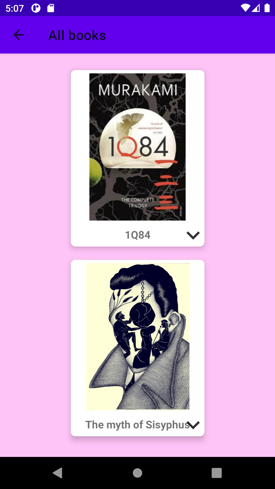

# BookApp

## App description

 

Simple android application which let's the user to choose a book and view it's details. User can add his book to wishlist, already read list or mark it as already read. After reading it he can delete it from his list of books.

 

  
 
 
